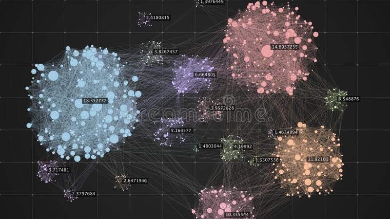

# clustering

  

Clustering consiste em agrupar um conjunto de dados com base em suas semelhanças. Ao contrário de métodos de classificação e regressão, estamos lidando com aprendizagem não supervisionada, onde algoritmos compreendem as relações entre um conjunto de dados.

Aplicação
Podemos aplicar clustering em diversos setores da indústria. Alguns exemplos incluem:

* Segmentação de mercado.
* Análise de rede social.
* Agrupamento de resultados da pesquisa.
* Imagem médica.
* Segmentação de imagens.
* Detecção de anomalias.

## Authors

- [@gabe1007](https://github.com/gabe1007)

